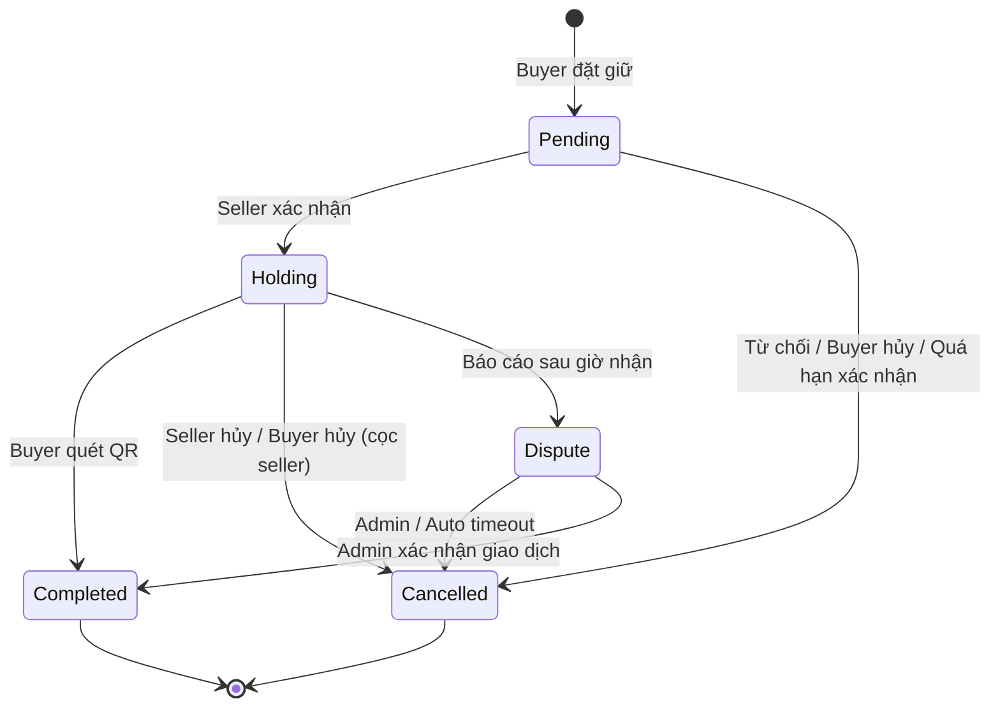

# FastMark — State Machine đơn giữ hàng

## Tab UX (5 tab)

| Tab | Status DB | Mô tả |
|-----|-----------|--------|
| Chờ xác nhận | `0` PENDING | Buyer gửi yêu cầu, chờ seller |
| Giữ hàng | `2` WAITING_PICKUP | Seller đã xác nhận, chờ nhận |
| Tranh chấp | `4` DISPUTED | Có ≥1 báo cáo sau giờ nhận |
| Hoàn thành | `3`, `5` | Giao dịch thành công (QR / admin) |
| Đã hủy | `1`, `6`, `7` | Từ chối / hoàn cọc / hủy sau giữ hàng |

## Enum OrderStatus (`RESERVATION_STATUS`)

```
0 PENDING_SELLER_CONFIRMATION
1 REJECTED
2 WAITING_PICKUP
3 COMPLETED
4 DISPUTED
5 AUTO_COMPLETED (legacy / admin hoàn tất)
6 REFUNDED
7 DISPUTE_RESOLVED (hủy, cọc về seller hoặc buyer tùy case)
```

## Enum CancelReason (`RESERVATION_CANCEL_REASON`)

Mã lưu trong `Reservation.cancelReason`. Nhãn hiển thị theo viewer (`buyer` | `seller`) — xem `CANCEL_REASON_VIEW_LABELS`.

| Mã | Buyer thấy | Seller thấy | Cọc |
|----|------------|---------------|-----|
| `seller_rejected` | Yêu cầu bị từ chối | Bạn đã từ chối | Hoàn buyer |
| `buyer_cancel_pending` | Bạn đã hủy | Người mua đã hủy | Hoàn buyer |
| `confirm_timeout` | Quá hạn xác nhận | Bạn đã bỏ lỡ xác nhận | Hoàn buyer |
| `buyer_received` | Đã nhận hàng | Đã giao hàng | → Seller |
| `seller_cancel_holding` | Người bán đã hủy | Bạn đã hủy | Hoàn buyer |
| `buyer_cancel_holding` | Bạn đã hủy | Người mua đã hủy | → Seller |
| `buyer_report_seller_absent` | Người bán không có mặt | Bạn không có mặt | Giữ escrow |
| `seller_report_buyer_no_show` | Bạn không đến nhận | Người mua không đến nhận | Giữ escrow |
| `dispute_both_reported` | Đang tranh chấp | Đang tranh chấp | Giữ escrow |
| `pickup_timeout` | Quá hạn nhận hàng | Đã quá hạn | → Seller |
| `admin_buyer_win` | Người bán vắng mặt | Không có mặt | Hoàn buyer |
| `admin_seller_win` | Bạn không đến nhận | Người mua không đến nhận | → Seller |
| `admin_completed` | Đã nhận hàng | Đã giao hàng | → Seller |
| `seller_account_locked` | Người bán bị khóa | Tài khoản bị khóa | Hoàn buyer |
| `buyer_account_locked` | Tài khoản bị khóa | Người mua bị khóa | Hoàn buyer |

## Enum DisputeReason (`RESERVATION_DISPUTE_REASON`)

Dùng trong form báo cáo & `Reservation.disputeReason`:

- `seller_absent`, `shop_closed`, `seller_no_delivery`, `other`
- `buyer_no_show` (seller báo)

## MongoDB Schema (Reservation)

```javascript
{
  status: Number,              // RESERVATION_STATUS
  cancelReason: String,        // RESERVATION_CANCEL_REASON code
  cancelNote: String,          // Ghi chú tự do (seller hủy / admin)
  cancelledBy: String,         // buyer | seller_reject | seller_after_accept | admin | system
  cancelledBySellerAfterAccept: Boolean,
  depositSettleTo: Number,     // 0 held | 1 buyer | 2 seller
  disputeByBuyer / disputeBySeller: Boolean,
  disputeReason: String,
  pickupTime, autoReleaseAt,    // pickupTime + 24h
}
```

## API chuyển trạng thái

| Hành động | API | From → To |
|-----------|-----|-----------|
| Seller xác nhận | `POST /seller/reservations/:id/confirm` | 0 → 2 |
| Seller từ chối | `POST /seller/reservations/:id/reject` | 0 → 1 |
| Buyer hủy (pending) | `POST /buyer/reservations/:id/cancel` | 0 → 6 |
| Buyer hủy (holding) | `POST /buyer/reservations/:id/cancel` | 2 → 7 (+ cọc seller) |
| Quá hạn xác nhận | Job `processReservationLifecycle` | 0 → 1 |
| Buyer quét QR | `POST /buyer/reservations/confirm-received` | 2 → 3 |
| Seller hủy sau xác nhận | `POST /seller/reservations/:id/cancel` | 2 → 6 |
| Buyer báo cáo seller | `POST /reports/buyer-report-seller` | 2/4 → 4 |
| Seller báo buyer | `POST /seller/reservations/:id/report-buyer` | 2/4 → 4 |
| Quá 24h không báo cáo | Job | 2 → 7 (pickup_timeout) |
| Admin buyer thắng | `POST /admin/reports/:id/approve-buyer` | 4 → 6 |
| Admin seller thắng | `POST /admin/reports/:id/approve-seller` | 4 → 7 |
| Admin hoàn / giải phóng | `POST /admin/reservations/:id/refund|release` | 4 → 6/7 |

## State diagram (tóm tắt)



## Edge cases

- **Hai bên cùng báo cáo:** status=4, cọc giữ escrow đến admin xử lý.
- **Một bên báo cáo, bên kia im 24h:** auto buyer/seller win.
- **Không ai báo cáo 24h:** hủy (`pickup_timeout`), cọc → seller (không tính sold).
- **Buyer hủy khi holding (trước giờ nhận):** cọc → seller (không hoàn buyer).
- **Data cũ:** `inferCancelReasonCode()` suy ra mã từ `cancelledBy`, flags, status.

## UI

- **Buyer/Seller app:** 5 tab `ORDER_STATUS_TABS`, lý do qua `getReservationReasonLabel(item, role)`.
- **Admin web:** tab Tranh chấp (`tab=disputes`), hoàn cọc / giải phóng trên `ReservationDetailPage`.

## Đã triển khai

- **Khóa tài khoản:** `cancelActiveReservationsForAccountLock()` — gọi từ `adminAccountService.setAccountStatus` khi block; hủy đơn active (0/2/4), hoàn cọc buyer, lý do `seller_account_locked` / `buyer_account_locked`.
